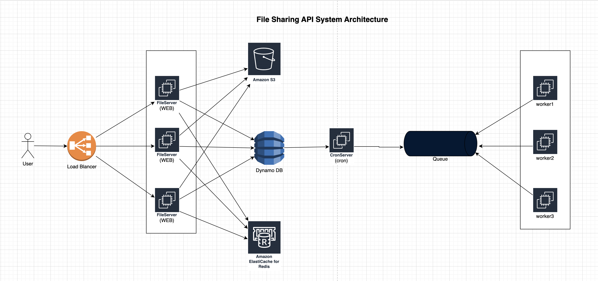
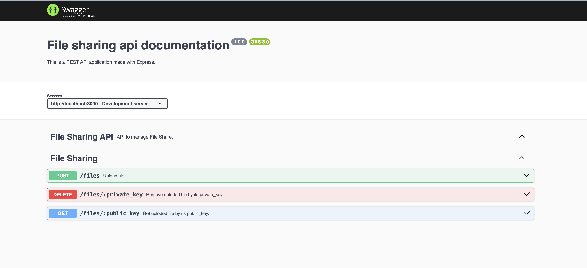

# Simple file sharing API

## System Architecture Diagram



---

## Installation

#### Step 1:

Clone the repository by running the following command:

```bash
git clone https://github.com/AtiqulHaque/nodejs-file-sharing-api
cd nodejs-file-sharing-api
```

#### Step 2:

Copy the environment file then update the env values accordingly:

```bash
cp config.env .env
```

#### Step 3:

Install the required dependencies:

```bash
npm install
```

#### Step 4:

Start the API server using Docker:

```bash
npm run start
```

Application will be started and available at http://localhost:3000/api/ping

#### Step 5:

To run unit tests, execute the following command:

```bash
npm run test
```

## Folder Structure

```text

.
├── Dockerfile
├── Makefile
├── README.md
├── config.env
├── cron
│   ├── index.js
│   ├── jobs
│   │   ├── ping.js
│   │   └── storage_cleanup.js
│   ├── jobs.js
│   └── utils.js
├── database
│   ├── bootstrap.js
│   ├── models
│   │   └── FileModel.js
│   └── repositories
│       └── FileRepository.js
├── db
│   └── file.json
├── docker-compose.yml
├── ecosystem.config.js
├── index.js
├── middlewares
│   └── rateLimiter.js
├── package-lock.json
├── package.json
├── services
│   ├── FileDeleteService.js
│   ├── FileDownloadService.js
│   ├── FileUploadService.js
│   ├── GeneratekeyService.js
│   ├── ImageUpload.js
│   └── storage
│       ├── LocalStorageService.js
│       ├── S3StorageService.js
│       └── StorageFactory.js
├── settings
│   ├── app.js
│   └── providers
│       ├── google.js
│       └── s3.js
├── test
│   ├── example.test.js
│   ├── file.test.js
│   ├── index.spec.js
│   └── math.test.js
├── uploads
├── utilities
│   ├── CacheHandler.js
│   ├── DefaultResponse.js
│   ├── apiFeatures.js
│   ├── appError.js
│   ├── base62Encoder.js
│   ├── bullmq.js
│   ├── filterText.js
│   ├── logger.js
│   ├── math.js
│   ├── network.js
│   ├── newrelic.js
│   ├── redis.js
│   ├── response.js
│   ├── scoreSettings.json
│   └── sentry.js
├── web
│   ├── controllers
│   │   ├── FileProcessController.js
│   │   ├── WelcomeController.js
│   │   └── tasks.js
│   ├── docs
│   │   └── docs.js
│   ├── index.js
│   ├── routers
│   │   ├── FileProcessRouter.js
│   │   └── tasks.js
│   └── validators
│       └── FileDeleteValidators.js
└── workers
    ├── config.js
    ├── handlers
    │   ├── cleanup.js
    │   ├── ping.js
    │   └── storage_cleanup.js
    └── index.js
```

### 1. `postman`

-   This directory typically contains documentation related to the Postman Collection

## API Specification



---
